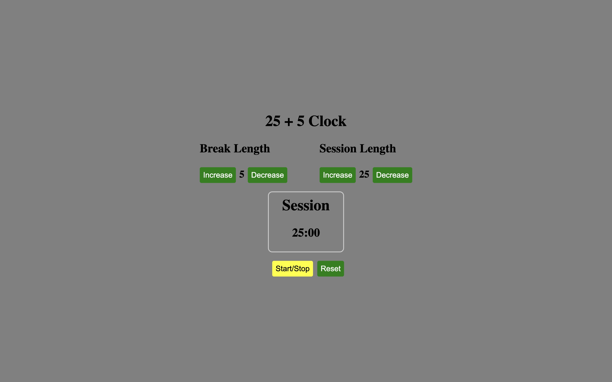

# Pomodoro Timer

An App that works as an Pomodoro Timer.

## Screenshots

## Demo

[Link](https://codepen.io/thepageguy/pen/MWZOgGb)

## Author

- [@thepageguy](https://www.github.com/thepageguy)

## Acknowledgement

- [FreeCodeCamp](https://www.freecodecamp.org/)

## Tech Stack

**Languages:** HTML5, CSS3 and React.js

## Features

- Working Timer
- Modify Session time
- Modify Break time
- Start/Stop/Reset Timer

## Lessons Learned

- Math JS Library
- React useState
- Timing Elements

## Feedback

If you have any feedback, please reach out at thepageguy@mailfence.com.